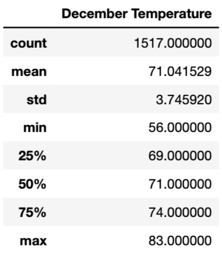
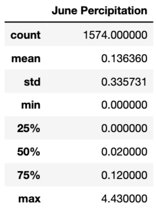

# Oahu Surf Shop Analysis

## Overview

The purpose of this project is to analyze weather data using SQLite to see if it is worth openning a surf shop on Oahu.

## Results 

The results of this analysis are comprised from looking at annual temperature data from the months of June and December.

### June Takeaways

1. The average temperature is 74.94 degrees fahrenheit
2. The minimum temperature is 64 degrees fahrenheit
3. The maximum temperature is 85 degrees fahrenheit

This data is comprised of 1700 entries.

!["June Summary Data]"](resources/june_temp.png)

### December Takeaways

1. The average temperature is 71.04 degrees fahrenheit
2. The minimum temperature is 56 degrees fahrenheit
3. The maximum temperature is 83 degrees fahrenheit

This data is comprised of 1517 entries.

### Summary

By looking at the results, opening a surf shop would be a smart investment. This is because there is an enjoyable average temperature in two months that are 6 months apart from one another. That shows that for most months of the year, there will be enjoyable temperature for people to come and use the surf shop.

To dive a little deeper, we looked at the percipitation levels through the two months as well. The major takeaways from this analysis are:

1. The average percipitation is 0.136 inches per day in June
2. The average percipitation is 0.217 inches per day in December
3. 50% of days in June have less than 0.02 inches of percipitation and 75% have less than 0.12 inches of percipitation
4. 50% of days in December have less than 0.02 inches of percipitation and 75% have less than 0.12 inches of percipitation
5. The maximum percipitation is 4.43 inches on a single day in June
6. The maximum percipitation is 6.42 inches on a single day in December

By looking at this further analysis it shows that there is little amount of percipitation on a normal day, but there is still days with excessive rainfall. This shows that the surf shop will be able to stay open on most days while a few rainy days will help keep the island ecosystem lush and inviting to people wanting to visit the surf shop.

## More Queries Possible

* This is a temperature dependent business, but also weather; people are less likely to be at the beach looking for surfing and ice cream in the rain. We could do additional queries on the same data to look at rainfall patterns, to better understand another vector that may cause slow periods for this potential business.
* We could also pull in data from across the year, rather than two targeted months, as we are introducing bias and assumption by targeting June and December as representative months. 